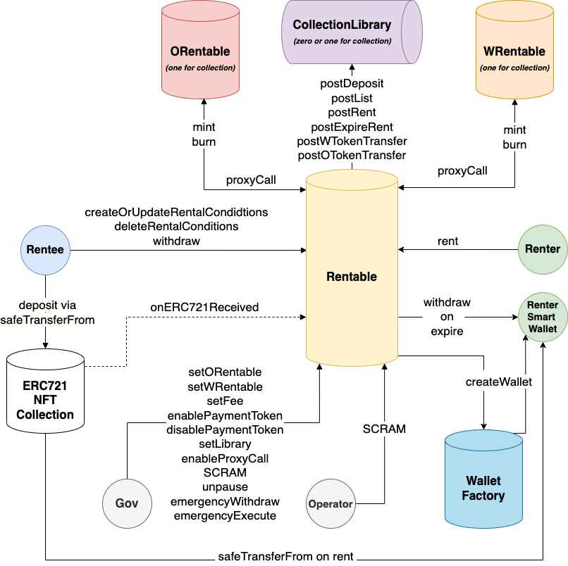

# Rentable Protocol

NFT Renting Protocol

## Architecture

- [`Rentable.sol`](contracts/Rentable.sol): protocol core logic. It holds all the NFT deposited.
- [`ORentable.sol`](contracts/tokenization/ORentable.sol): ERC721 token representing deposits (and asset ownership). Each NFT collection has a respective `ORentable` with the same token ids. It is minted on deposit and burnt on withdraw. `ORentable` can contain custom logic and use `Rentable.proxyCall` to operate on deposited assets.
- [`WRentable.sol`](contracts/tokenization/WRentable.sol): ERC721 token, wrapper of the original NFT representing the rental. Each NFT collection has a respective `WRentable` with the same token ids. It is minted when rental starts and burnt on expiry. `WRentable.ownerOf` reflects rental duration (i.e., renter loses `WRentable` owerniship when rental period is over). `WRentable` can contain custom logic and use `Rentable.proxyCall` to operate on deposited assets.
- [`ICollectionLibrary.sol`](contracts/collections/ICollectionLibrary.sol): interface to implement hooks on protocol events (e.g., `postDeposit`, `postRent`) for a given collection. Governance can set a Collection Library via `Rentable.setLibrary`.
- [`SimpleWallet.sol`](contracts/wallet/simplewallet.sol): smart wallet used by the renter, cannot withdraw the rented assets but only interact with allowed protocols/methods. Implements EIP1217 for Standard Signature Validation enabling Wallet Connect logins.
- [`WalletFactory.sol`](contracts/wallet/simplewallet.sol): factory for smart wallets, used by Rentable to generate upgradeable smart wallets for users.

The following diagram shows the main components and their interactions. _ERC721 NFT Collection_ represents a generic NFT collection (e.g., Decentraland LAND) and it is not part of Rentable.



## Main flows

- **Rentee deposits an NFT (without listing)**
  - Call `safeTransferFrom(ownerAddress, rentableAddress, data)` on the NFT collection contract with empty data
- **Rentee deposits and lists an NFT**
  - Call `safeTransferFrom(ownerAddress, rentableAddress, data)` on the NFT collection contract with [RentableTypes.RentalConditions](contracts/RentableTypes.sol) encoded in the `data` field
  - Rentee receives a `ORentable` token representing the deposit (and asset ownership)
- **Rentee changes the rental conditions of a listed NFT**
  - Call `createOrUpdateRentalConditions` on Rentable
- **Rentee delists an NFT**
  - Call `deleteRentalConditions` on Rentable
- **Rentee withdraws an NFT**
  - Call `withdraw` on Rentable
- **Renter rents an NFT**
  - Call `rent(address tokenAddress, uint256 tokenId, uint256 duration)` on Rentable
    - if payment token is Ether, renter must pay `pricePerSecond*duration`
    - if payment token is ERC20 or ERC1155, renter must have an amount equals to `pricePerSecond*duration` and approve Rentable to transfer it
  - Renter receives a `WRentable`
  - Renter receives the original NFT in its own `SimpleWallet` (cannot withdraw, only interact on owner approved protocols/methods)

## Requirements

To run the project you need:

- Python 3.8 local development environment and Node.js 14.x development environment for Ganache.
- Brownie local environment setup. Install
  [instructions](https://eth-brownie.readthedocs.io/en/stable/install.html).
- Foundry. Install [instructions](https://github.com/gakonst/foundry#installation)

## Test

```bash
yarn test
```

## Installation

To use the tools that this project provides, please pull the repository from GitHub
and install its dependencies as follows.
You will need [yarn](https://yarnpkg.com/lang/en/docs/install/) installed.
It is recommended to use a Python virtual environment.

```bash
git clone https://github.com/rentable-world/rentable-protocol
cd rentable-protocol
yarn install --lock-file
pip install -r requirements-dev.txt
```

## Usage

1. Choose network
2. Deploy contracts (or use already deployed ones)
3. Prepare your account
4. Use network console

Remember to [add](https://metamask.zendesk.com/hc/en-us/articles/360043227612-How-to-add-a-custom-network-RPC) the network to your Metamask

### Network

Run the following commands respectively and keep the session open. Network is ephemeral, when you close the command you reset it.

#### Local Testnet

```bash
yarn network:testnet
```

#### Mainnet Fork

Useful to interact with other protocols in mainnet via a local fork.

You need local env variables for [Etherscan API](https://etherscan.io/apis) and [Infura](https://infura.io/) (`ETHERSCAN_TOKEN` `WEB3_INFURA_PROJECT_ID`).

Set them in `.env` file following `.env.example`

```bash
yarn network:mainnet-fork
```

### Deploy contracts

```bash
yarn deploy:testnet
```

### Use network console

Run the console

```bash
yarn console
```

and interact directly with contracts

Example: Check owner of `tokenId = 4` for NFT with smart contract address `0x734f99154988a737ae7159594Ebf828eB6761645`

```python
>>> t = TestNFT.at('0x734f99154988a737ae7159594Ebf828eB6761645')
>>> t.ownerOf(4)
'0x5898D8D9a8895dBBd3d035724FA1Bc252876cC22'
>>>
```

### Run tests

```bash
yarn test
```

## Prod Deployment (Ethereum Mainnet)

- Deployer: 0xf6798a60B576658461eeFebf583C2AaECD732334
- Governance: 0xC08618375bb20ac1C4BB806Baa027a4362156fE6
- Operator: 0x49941c694693371894d6DCc1AbDbC91A7395b703
- FeeCollector: 0xa55D576DE85dA4295aBc1E2BEa5d5c77Fe189205
- ProxyAdmin: 0xdb246e57c401792Fd272314ce666f5dB07E89e67

- OLogic: 0xe1ac13c21e3F1EeBF71CC0F9e74D6059AbAc7970
- OBeacon: 0x31c82151B1fDD035C64EB8b4c896AFF799ca63b1
- WLogic: 0x160AC61AFb9323B372FEeB157471F23984544dFb
- WBeacon: 0x3Ec6fd32bb71fc288f18DCc1F2EBd6Bb00BAB25f

- SimpleWalletLogic: 0x0a988B2b8B53de1B21dbE0CfFB68eB6B6664868b
- SimpleWalletBeacon: 0x268bC6FC0aB22847d9DE037DcEEb8F656826EF44
- WalletFactory: 0x4d0662FB57464EEf4Dc9431Bd49dF949B039836D

- Rentable: 0xd766a11858c57252cC4F9978282B616C3e0bBAC4
- RentableLogic: 0xAcc7E1D41f62Eb75309a28D0a3D29F09DbbC56ca

- Decentraland (LAND): 0xF87E31492Faf9A91B02Ee0dEAAd50d51d56D5d4d
- OLandLogic: 0xc1E572797De159155174fEfa7BC0f023649153bf
- OLandBeacon: 0x3b2Fb54b9f57ad9AEB9103aF55E10905dee0d8b1
- OLand: 0xcE6AC4D01d18B99BF7926a2cdFa87D03d271d3d8
- WLand: 0x21Fc48317b1772997EF4753a82f7CB4A26Eb2E07
- Library: 0x2B0672f10C2f6487394B5760e2E0A69ca6a4C710

- Meebits: 0x7Bd29408f11D2bFC23c34f18275bBf23bB716Bc7
- OMeebits: 0xBEc515aac1d601E8A1Ce7baaD493A80DaD667E33
- WMeebits: 0x9A87c43c15d7ba0e4eA9B7AB9A0a0821C8777e94

- LobsterDAO: 0x026224A2940bFE258D0dbE947919B62fE321F042
- OLOBS: 0x4fE71Dafdd15Ef1F9308F249Bc7eaE1fd48ba828
- WLOBS: 0xc0fdE9d7D28376CFEcAc37971397f01d2D9dfA59

## Experimental Deployment (Rinkeby)

```
              Deployer: 0xf6798a60B576658461eeFebf583C2AaECD732334
            Governance: 0xf6798a60B576658461eeFebf583C2AaECD732334
              Operator: 0xf6798a60B576658461eeFebf583C2AaECD732334
          FeeCollector: 0xf6798a60B576658461eeFebf583C2AaECD732334
               TestNFT: 0x8fA4d7B0C204B8f03C9f037E05Cece57decE2214
               OBeacon: 0x6a54CAB15d7eDF3D97af0b73E2aC9e5e430359Ed
             ORentable: 0x029675B6bF1FE9bB55c8a46A18BEc30E70EdFC6e
               WBeacon: 0x94ddf9510c0BE76867ebc46dFDa4509dB492B30b
             WRentable: 0x9fa166996E2f1110332589f6E0f924a45fac4cAD
     SimpleWalletLogic: 0x23588c541018EE522e0C9BDea7172214e61b3a66
    SimpleWalletBeacon: 0x09B76511d6f91081B6b5d316BC479b41803Cf888
         WalletFactory: 0x8C0F6D5AfF5B5f6731cF976C0343ACA2F0d38ddC
              Rentable: 0xb8Cd02CbCc05Ac25D77F63FAbB2501Bb71f9e2BB
         RentableLogic: 0x7d9ba195f29C1a0102e8daAD16091f3d79486216
            ProxyAdmin: 0xA9853c327d9F695FCCA73e592Cb624d1EcB60835
```

## Security

For security concerns, please visit [Bug Bounty](https://github.com/rentable-world/rentable-protocol/security/policy).
